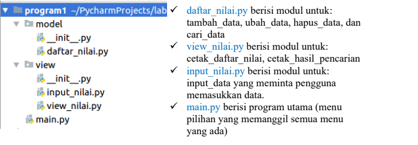
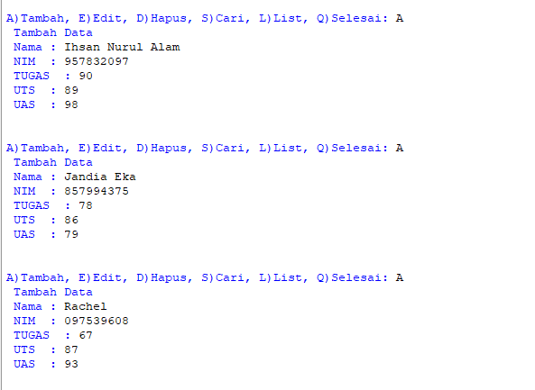
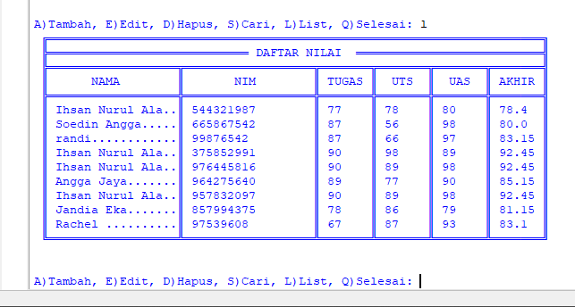
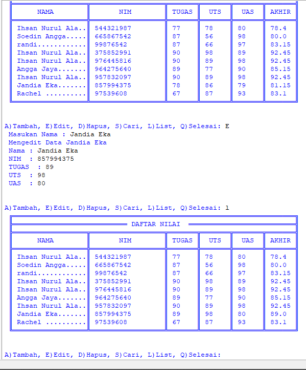
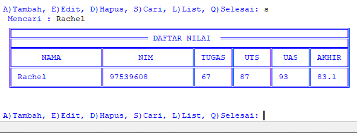
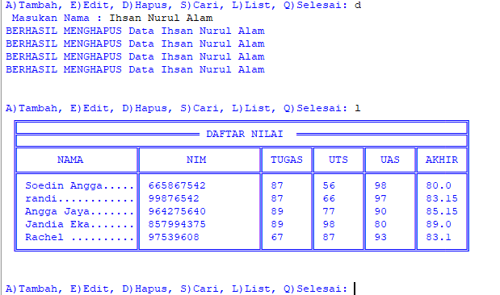

# UAS IHSAN NURUL ALAM
Soal!
Buatlah package dan modul dengan struktur seperti berikut:

Kemudian buat file README.md yang berisi penjelasan dan screenshot hasil eksekusi
program. Lalu upload ke repository github masing-masing.
## PENYELESAIAN
Dari soal tersebut di peintahkan untuk menambahkan perintah :
- Tambah 
- Edit
- Hapus
- Cari
- List
Di program ini saya menambahkan perintah berikut :
- A = add(tambah)
- E = edit
- D = Delete(Hapus)
- S = Search(cari)
- L = List
- Q = quit(keluar) untuk mengakhiri program
Berikut ini untuk gambar penyelesaiannya :
1. Untuk menambahkan data nilai 

untuk menambahkan data perintahnya adalah dengan klik A (tambah/add) seperti dicontohkan pada gambar tersebut saya menambahkan data Ihsan Nurul Alam,Jandia Eka dan Rachel.
2. Untuk melihat data yang sudah ditambahkan 

untuk melihat daftar nilai yang telah kita tambahkan klik L (list) maka akan muncul daftar nilai yang telah kita tambahkan.
3. Untuk mengubah data 

untuk mengubah data yang telah kita tambahkan maka klik E (edit) pada keyboard anda. Seperti di contohkan pada gambar tersebut, saya mengubah nilai dari Jandia Eka.
4. Untuk mencari data

Untuk mencari data nama atau nilai maka klik S (search/cari)
lalu masukan nama yang ingin kita cari seperti dicontohkan pada gambar saya mencari data atas nama Rachel.
5. Untuk menghapus data

untuk menghapus data maka klik D (delete/hapus) seperti dicontohkan pada gambar saya meghapus data atas nama Ihsan Nurul Alam maka secara otomatis data tersebut akan terhapus.
### TERIMAKASIH